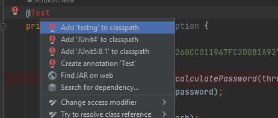
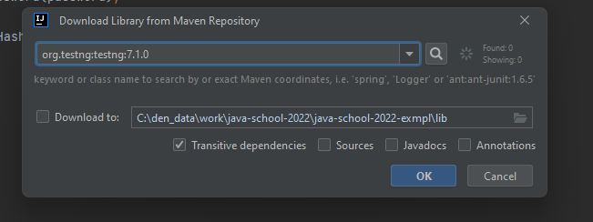
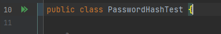
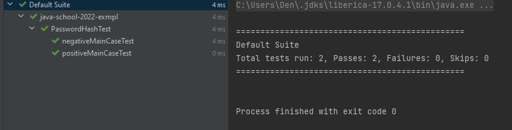

# croс-spring-java-school-2024-homework

## Контакты

Эксперты:
- Женя     
  - https://t.me/evoynov 
  - https://github.com/evoynov
- Андрей   
  - https://t.me/Dfire1210 
- Полина   
  - https://t.me/ppuzak
  - https://github.com/ppuzak
- Денис    
  - https://t.me/illitain       
  - https://github.com/illitain


## 1. Общее описание
Этот проект - пример структуры для выполнения домашнего задания в рамках Java школы 2024 года от КРОК.
Основные моменты:
1) В проекте должен быть readme.md-файл, в котором должна быть информация об авторе (имя, фамилия. Ник в телеграме)
2) Структура проекта - согласно примеру. Код лежит в папке src в пакетах ru.croc.javaschool2024.<фамилия>, где уже находятся пакеты каждой из задач (taskN). То есть решение каждой задачи - в своем пакете.
3) Репозиторий github должен быть приватным, но доступ к нему должен быть выдан всем экспертам (их аккаунты указаны выше)
4) При написании кода не забывайте о правилах кодирования на Java! Основные моменты: 
   - Обращайте внимание на названия классов, атрибутов и методов, а также имена переменных. Все они должны быть информативны и понятны.
   - По классам - название основных классов (с main-методом) должно соответствовать шаблону: TaskN, где N - номер задачи
   - В одной строке не должно быть большое количество операторов. В идеале - один оператор на строку, последующие - переносите на новые.
   - ИНФОРМАТИВНЫЕ комментарии (особенно если где-то неуверены, сами понимаете, что пишите запутанный код и/или из нескольких альтернатив реализации выбрали что-то конкретное - прям пишите что рассматривали, что выбрали и почему).

P.S. В интернете много информации о правилах кодирования на Java. В целом, первая ссылка гугла по большей части описывает неплохо, хотя я лично привык переносить длинные строки не в формате 
```
int result = function1(longExpression1,
function2(longExpression2,
longExpression3));
```
А в формате:
```
int result = function1(
   longExpression1,
   function2(
      longExpression2,
      longExpression3
   )
);
```

## 2. Подключение тестов

В данном проекте присутствуют тесты для задач - они служат вам возможностью проверить ваше решение, 
а нам - одним из критерием работоспособности.
Для подключения необходимых библиотек - ниже приведена инструкция для IDE Intellij Idea.
Инструкции для других IDE могут быть добавлены по вашему запросу :)

Шаг 1: зайти в класс с тестом

Шаг 2: найти аннотацию @Test, поставить курсор на неё. Сама аннотация должна подсвечиваться как ошибка(красным)

Шаг 3: нажать alt+enter - вызов контекстного меню. Результат - на скрине ниже.



Шаг 4: выбрать первый пункт ("Add "testng" to classpath"). В результате появится окно на скриншоте ниже.



Шаг 5: нажать "ОК"

Финиш: ошибки компиляции должны пропасть, аннотация должна перестать подсвечиваться красным.


## 3. Использование тестов

Перед переводом задачи на проверку (=отметки в доке) необходимо прогнать все тесты по этой задаче.
Для этого для каждого класса с тестами (все находятся в пакете tests соответствующей задачи) запустить все тесты, 
нажав кнопку запуска (в виде двух наложенных значков "play") слева от объявления класса:



Результат выполнения тестов нужно заскриншотить и быть готовым отправить проверяющему.
Пример скриншота с корректного выполненными тестами:




## 4. Правила выполнения домашних заданий

- Задачи выдаются либо в день лекции, либо на следующий. Выдача задач происходит путем публикации их в новом пакете в этом репозитории. Описание задачи находится в md файле, рядом могут находиться классы, подразумевающиеся для использования в задаче.
- У вас есть неделя (до следующей лекции) для того, чтобы залить полное решение в свой гитхаб и отметиться в табличке (ссылка в чате в тг).
- После этого Эксперт проверяет вашу задачу, проставляет за нее баллы и выдает обратную связь.
- На правки по обратной связи у вас есть еще неделя, так же до следующей лекции.
- И после этого Эксперт еще раз проверяет вашу задачу, выдает итоговую обратную связь и, при необходимости, корректирует балл за задачу.

Таким образом цикл проверки задачи по умолчанию составляет две недели - одну на реализацию и одну на правку.
Если в течение первой недели вы не предоставили основное решение (или оно было явно залито с целью залить хоть что-то), то на второй неделе шанса на правку у вас не будет.

ВАЖНО: эти правила - некий минимум, который гарантируется при проверке. Наша цель здесь - поделиться с вами знаниями, а ваша - эти знания получить.
Поэтому по желанию Эксперта правила могут нарушаться в пользу студента (3 проверки за эти две недели вместо двух, доп.время на правку или учет задачи после дедлайна, если были объективные причины).
Еще раз - могут, но не факт, что будут. Все на усмотрение Эксперта.
